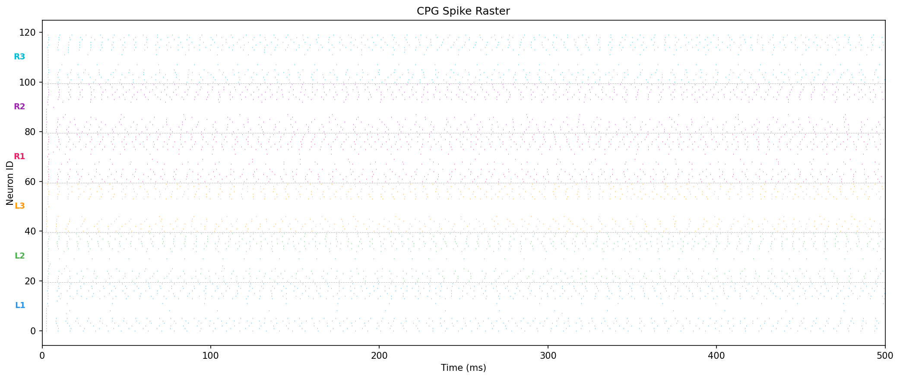
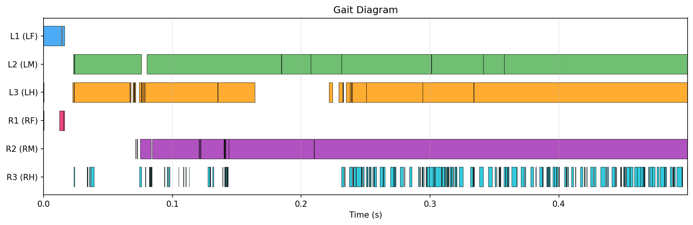

# embodied-fly

I wanted to see if I could make a virtual fruit fly walk using a simulated brain instead of training it with RL.

## What I did

I built a small spiking network (120 LIF neurons) organized into 6 groups, one per leg. Each group has neurons that fire back and forth to create a rhythm. I connected the groups so the legs alternate in a tripod pattern, which is how real flies walk. Then I plugged that into NeuroMechFly v2 (a virtual fly body in MuJoCo) and hit run.

It walks. Badly, but it walks.

## How to run

```bash
pip install -r requirements.txt
pip install flygym

python scripts/run_simulation.py --duration 0.5
python scripts/compare_gaits.py
pytest tests/ -v
```

## Structure

```
src/
├── cpg/              # The neuron network
├── embodiment/       # Fly body + spike-to-joint mapping
├── analysis/         # Gait measurements
└── visualization/    # Plots
```

## What I learned

- Getting neurons to oscillate is the easy part. Turning that into actual walking is where everything breaks.
- The gait drifts over time because there's no sensory feedback. Real flies feel their legs and adjust constantly.
- I was surprised that 120 neurons can produce anything resembling coordination at all.

## Results

Spike raster showing the 120-neuron CPG network activity. Each row is a neuron, color-coded by leg module:



Gait diagram showing stance (filled) and swing (empty) phases for each leg:



## What's missing

- Sensory feedback
- Real synaptic weights from the connectome (mine are hand-tuned)
- More neuron types
- Speed control

## References

- Dorkenwald et al. (2024). Neuronal wiring diagram of an adult brain. Nature.
- Azevedo et al. (2024). Connectomic reconstruction of a female-brain Drosophila ventral nerve cord. Nature.
- Wang-Chen et al. (2024). NeuroMechFly v2. Nature Methods.
- Ijspeert (2008). Central pattern generators for locomotion control. Neural Networks.
